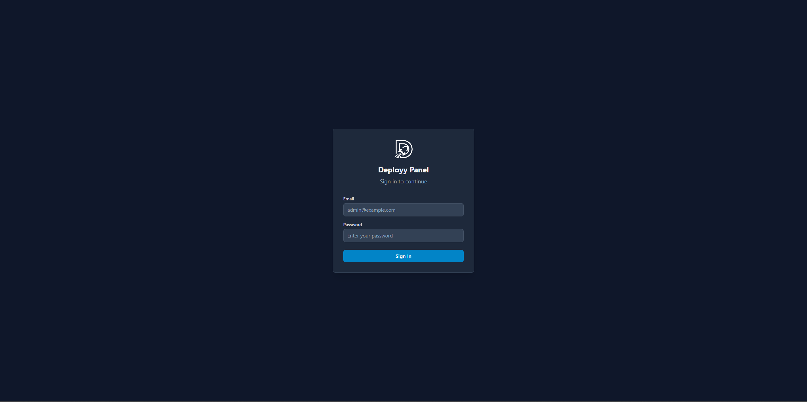
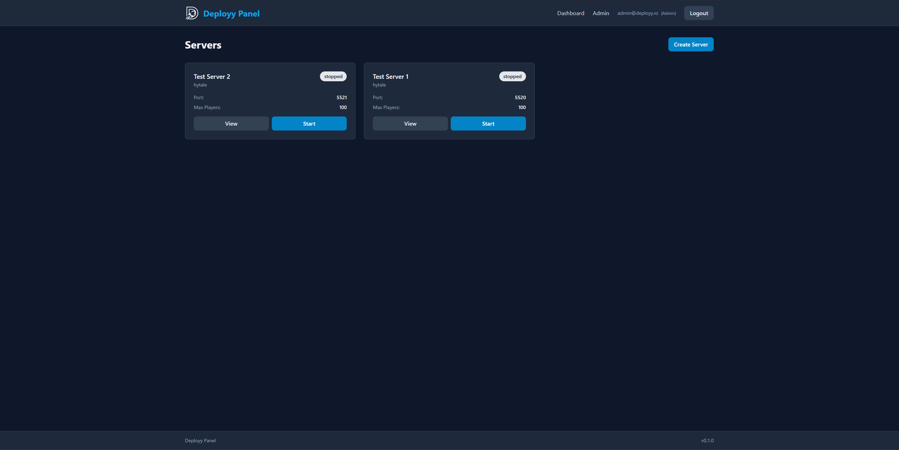
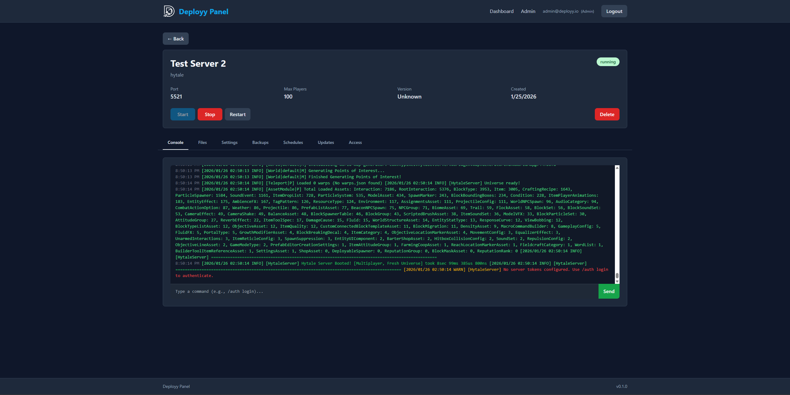
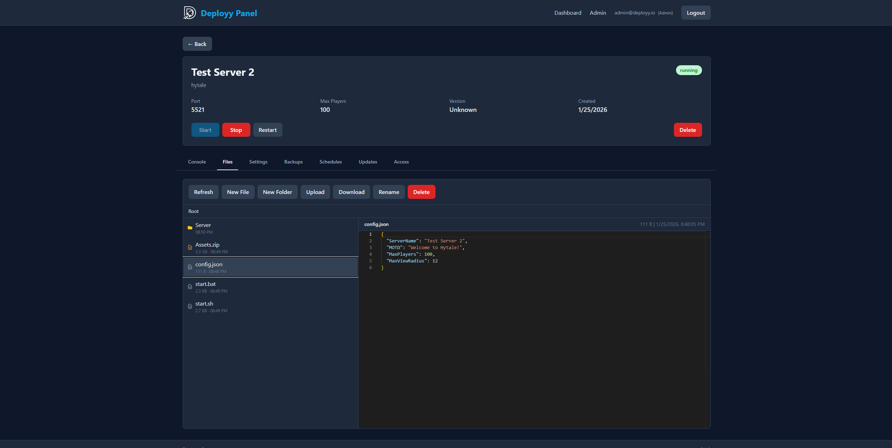
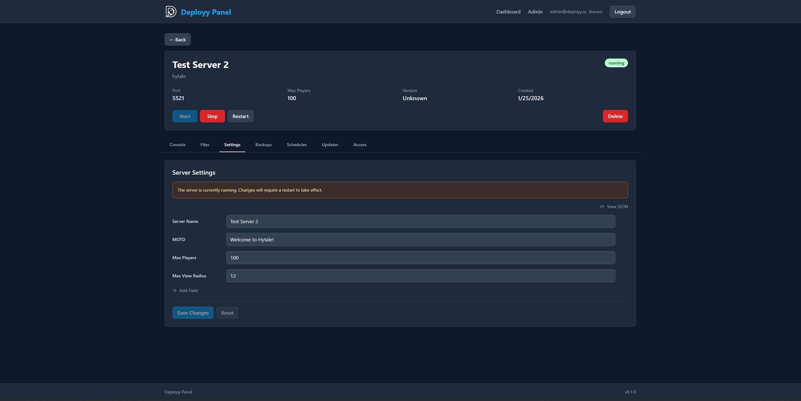
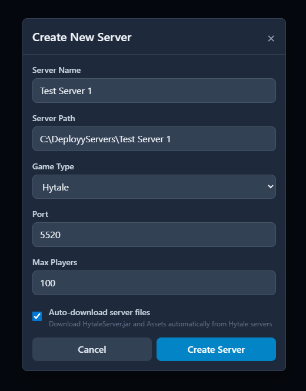

<p align="center">
  
</p>

<h1 align="center">Deployy Panel</h1>

<p align="center">
  Open-source, extensible game server management panel.<br>
  Currently supporting Hytale and Minecraft, with more games coming soon.
</p>

<p align="center">
  <a href="#features">Features</a> •
  <a href="#screenshots">Screenshots</a> •
  <a href="#quick-start">Quick Start</a> •
  <a href="#installation">Installation</a> •
  <a href="#production-deployment">Production</a> •
  <a href="#security">Security</a>
</p>

---

## Features

- **Multi-Server Management** - Create and manage multiple game servers from a single dashboard
- **Real-Time Console** - Live server logs with ANSI color support and command input
- **File Manager** - Browse, edit, upload, and download server files with Monaco Editor
- **Backup System** - Create, restore, and manage backups with retention policies
- **Scheduled Tasks** - Automate restarts, backups, and commands with cron scheduling
- **Dynamic Settings** - Auto-generated config editor based on server's JSON config
- **Roles & Permissions** - Panel-wide roles and per-server access levels
- **Multi-User Support** - Multiple users with different roles
- **Game Adapters** - Extensible architecture for adding new game support
- **Self-Updater** - One-click updates from GitHub releases
- **Cross-Platform** - Windows and Linux support
- **Docker Support** - One-command deployment
- **Anonymous Telemetry** - Opt-out usage analytics (no PII collected)

### Supported Games

| Game | Status | Flavors |
|------|--------|---------|
| Hytale | Supported (with auto-download via OAuth) | — |
| Minecraft | Supported (auto-download JAR) | Vanilla, Paper |

> **Note:** Minecraft currently supports **Vanilla** and **Paper** server types. Additional flavors (Forge, Fabric, Spigot, etc.) are planned for future releases.

---

## Screenshots

<details>
<summary>Click to view screenshots</summary>

### Login


### Dashboard


### Server Console


### File Manager


### Server Settings


### Server Creation


</details>

---

## Requirements

- **Node.js** 20+
- **pnpm** 8+
- **Java** 17+ for Minecraft, 25+ for Hytale ([Adoptium](https://adoptium.net/) recommended)

---

## Quick Start

```bash
git clone https://github.com/MillerSpil/Deployy-Panel.git
cd Deployy-Panel
pnpm install

# Build shared package (required before running)
pnpm --filter @deployy/shared build

# Setup backend
cd packages/backend
cp .env.example .env
# Edit .env and set JWT_SECRET (generate with: node -e "console.log(require('crypto').randomBytes(32).toString('hex'))")

pnpm prisma generate
pnpm prisma db push
pnpm prisma db seed

# Development (run in separate terminals)
# Terminal 1 - Backend:
pnpm dev

# Terminal 2 - Frontend:
cd ../frontend
pnpm dev

# Open http://localhost:5173
```

---

## Installation

<details>
<summary><strong>Docker</strong></summary>

The Docker image includes Java 25 (Eclipse Temurin) so game servers run inside the container.

```bash
git clone https://github.com/MillerSpil/Deployy-Panel.git
cd Deployy-Panel

# Create environment file
cp packages/backend/.env.example .env
# Edit .env — you MUST set these:
#   JWT_SECRET — minimum 32 characters (generate: openssl rand -hex 32)
#   FRONTEND_URL — your domain or IP (e.g. "https://panel.example.com")

# Build and start
docker compose up -d --build
```

The panel will be available at `http://localhost:3000`

**Volumes:**
- `./data` — Database (persisted across restarts)
- `./servers` — Game server files (maps to `/opt/deployy-servers` inside the container)

**Ports:**
- `3000` — Panel web UI
- `25565` — Minecraft (TCP)
- `5520` — Hytale (UDP/QUIC)

Add more port mappings in `docker-compose.yml` for additional servers.

**Commands:**
```bash
docker compose logs -f      # View logs
docker compose down         # Stop
docker compose up -d        # Start
docker compose up -d --build --no-cache  # Rebuild
```

</details>

<details>
<summary><strong>Manual Installation (Self-Hosted)</strong></summary>

```bash
# Clone and install dependencies
git clone https://github.com/MillerSpil/Deployy-Panel.git
cd Deployy-Panel
pnpm install

# Build shared package (required before anything else)
pnpm --filter @deployy/shared build

# Setup backend
cd packages/backend
cp .env.example .env
# Edit .env - set a secure JWT_SECRET (minimum 32 characters)
# Set NODE_ENV=production and FRONTEND_URL to your domain/IP

# Initialize database
pnpm prisma generate
pnpm prisma db push
pnpm prisma db seed
cd ../..

# Build frontend and backend
pnpm --filter @deployy/frontend build
pnpm --filter @deployy/backend build

# Start production server
cd packages/backend
NODE_ENV=production node dist/index.js
```

The panel serves at `http://localhost:3000`

</details>

<details>
<summary><strong>Development Setup</strong></summary>

```bash
# Clone and install
git clone https://github.com/MillerSpil/Deployy-Panel.git
cd Deployy-Panel
pnpm install

# Build shared package (required before anything else)
pnpm --filter @deployy/shared build

# Setup backend
cd packages/backend
cp .env.example .env
# Edit .env - set JWT_SECRET (minimum 32 characters, generate: openssl rand -hex 32)

# Initialize database
pnpm prisma generate
pnpm prisma db push
pnpm prisma db seed
```

Run in two terminals:

```bash
# Terminal 1 - Backend (port 3000)
cd packages/backend
pnpm dev

# Terminal 2 - Frontend (port 5173)
cd packages/frontend
pnpm dev
```

Open `http://localhost:5173`

</details>

---

## Production Deployment

For exposing Deployy Panel to the internet, you need HTTPS and a reverse proxy.

<details>
<summary><strong>Linux - Full Bare Metal Guide</strong></summary>

#### 1. Install Dependencies

```bash
# Node.js 20
curl -fsSL https://deb.nodesource.com/setup_20.x | sudo bash -
sudo apt install -y nodejs

# pnpm
sudo corepack enable
sudo corepack prepare pnpm@latest --activate

# Java 25+ (required for Hytale — https://adoptium.net/)
# Verify: java --version
```

#### 2. Create a Dedicated User

```bash
sudo useradd -r -m -d /home/deployy -s /bin/bash deployy
sudo groupadd deployy-devs
sudo usermod -aG deployy-devs $(whoami)
sudo mkdir -p /opt/deployy-panel /opt/deployy-servers
sudo chown deployy:deployy-devs /opt/deployy-panel /opt/deployy-servers
sudo chmod 2775 /opt/deployy-panel /opt/deployy-servers
```

#### 3. Clone and Build

```bash
sudo -u deployy git clone https://github.com/MillerSpil/Deployy-Panel.git /opt/deployy-panel
cd /opt/deployy-panel
sudo -u deployy pnpm install
sudo -u deployy pnpm --filter @deployy/shared build
cd packages/backend
sudo -u deployy pnpm prisma generate
sudo -u deployy pnpm prisma db push
sudo -u deployy pnpm prisma db seed
cd ../..
sudo -u deployy pnpm --filter @deployy/frontend build
sudo -u deployy pnpm --filter @deployy/backend build
```

#### 4. Configure Environment

```bash
sudo -u deployy cp packages/backend/.env.example packages/backend/.env
sudo -u deployy nano packages/backend/.env
```

```env
DATABASE_URL="file:./deployy.db"
PORT=3000
NODE_ENV=production
FRONTEND_URL="https://your-domain-or-ip"
SERVERS_BASE_PATH="/opt/deployy-servers"
JWT_SECRET="paste-output-of-openssl-rand-hex-32"
JWT_EXPIRATION="24h"
LOG_LEVEL="info"
TELEMETRY_ENABLED=true
```

Generate a JWT secret: `openssl rand -hex 32`

#### 5. Create systemd Service

```bash
# Create startup script
sudo tee /opt/deployy-panel/start.sh > /dev/null << 'EOF'
#!/bin/bash
cd /opt/deployy-panel/packages/backend
set -a
source .env
set +a
exec node dist/index.js
EOF
sudo chown deployy:deployy-devs /opt/deployy-panel/start.sh
sudo chmod 750 /opt/deployy-panel/start.sh

# Create service
sudo tee /etc/systemd/system/deployy-panel.service > /dev/null << 'EOF'
[Unit]
Description=Deployy Panel
After=network.target

[Service]
Type=simple
User=deployy
Group=deployy-devs
WorkingDirectory=/opt/deployy-panel/packages/backend
ExecStart=/opt/deployy-panel/start.sh
Restart=on-failure
RestartSec=5

[Install]
WantedBy=multi-user.target
EOF

sudo systemctl daemon-reload
sudo systemctl enable deployy-panel
sudo systemctl start deployy-panel
```

#### 6. Reverse Proxy (Caddy)

```bash
# Install Caddy — https://caddyserver.com/docs/install
sudo apt install -y caddy
```

**With a domain:**
```
panel.yourdomain.com {
    reverse_proxy localhost:3000
}
```

**With just an IP (self-signed cert):**
```
https://YOUR.IP.HERE {
    tls internal
    reverse_proxy localhost:3000
}
```

```bash
sudo systemctl restart caddy
```

#### 7. Firewall

```bash
sudo ufw allow 22/tcp     # SSH
sudo ufw allow 443/tcp    # HTTPS (panel)
sudo ufw allow 5520/udp   # Hytale (QUIC)
sudo ufw allow 25565/tcp  # Minecraft (if needed)
sudo ufw enable
```

#### 8. First Login

Open `https://your-domain-or-ip` in your browser. The first registered user becomes admin.

</details>

<details>
<summary><strong>Windows - Caddy</strong></summary>

Caddy automatically handles SSL certificates.

1. **Download Caddy** from https://caddyserver.com/download (Windows amd64)

2. **Create `Caddyfile`** in the same folder:
```
panel.yourdomain.com {
    reverse_proxy localhost:3000
}
```

3. **Run Caddy:**
```powershell
.\caddy.exe run
```

4. **Run as Windows Service (optional):**
```powershell
.\caddy.exe install
.\caddy.exe start
```

</details>

<details>
<summary><strong>Windows - Firewall</strong></summary>

```powershell
# Allow Hytale game server (UDP)
New-NetFirewallRule -DisplayName "Hytale Server" -Direction Inbound -Protocol UDP -LocalPort 5520 -Action Allow

# Allow Minecraft server (TCP)
New-NetFirewallRule -DisplayName "Minecraft Server" -Direction Inbound -Protocol TCP -LocalPort 25565 -Action Allow

# Allow HTTP/HTTPS
New-NetFirewallRule -DisplayName "HTTP" -Direction Inbound -Protocol TCP -LocalPort 80 -Action Allow
New-NetFirewallRule -DisplayName "HTTPS" -Direction Inbound -Protocol TCP -LocalPort 443 -Action Allow
```

</details>

<details>
<summary><strong>Linux - Nginx + Certbot (Alternative)</strong></summary>

1. **Install:**
```bash
sudo apt install nginx certbot python3-certbot-nginx
```

2. **Create config** (`/etc/nginx/sites-available/deployy`):
```nginx
server {
    listen 80;
    server_name panel.yourdomain.com;

    location / {
        proxy_pass http://localhost:3000;
        proxy_http_version 1.1;
        proxy_set_header Upgrade $http_upgrade;
        proxy_set_header Connection "upgrade";
        proxy_set_header Host $host;
        proxy_set_header X-Real-IP $remote_addr;
        proxy_set_header X-Forwarded-For $proxy_add_x_forwarded_for;
        proxy_set_header X-Forwarded-Proto $scheme;
    }
}
```

3. **Enable and get SSL:**
```bash
sudo ln -s /etc/nginx/sites-available/deployy /etc/nginx/sites-enabled/
sudo certbot --nginx -d panel.yourdomain.com
sudo systemctl restart nginx
```

</details>

---

## Configuration

<details>
<summary><strong>Environment Variables</strong></summary>

Create `.env` in `packages/backend/` (or project root for Docker):

```env
# Database
DATABASE_URL="file:./dev.db"

# Server
PORT=3000
NODE_ENV=development

# Frontend URL (dev only - for CORS)
FRONTEND_URL="http://localhost:5173"

# Game server storage (relative to backend, or absolute path)
SERVERS_BASE_PATH="./servers"
# SERVERS_BASE_PATH="/opt/deployy-servers"  # Linux absolute example

# Authentication (REQUIRED)
JWT_SECRET="your-secret-key-minimum-32-characters-here"
JWT_EXPIRATION="24h"

# Telemetry (set to false to disable)
TELEMETRY_ENABLED=true
```

**Generate JWT_SECRET:**
```bash
node -e "console.log(require('crypto').randomBytes(32).toString('hex'))"
```

</details>

<details>
<summary><strong>Server Storage Paths</strong></summary>

When creating a server, the path can be a simple folder name (e.g. `my-server`) or an absolute path. Relative names are created inside `SERVERS_BASE_PATH`:

- **Default:** `./servers/{server-name}` (relative to backend)
- **Linux production:** `/opt/deployy-servers/{server-name}`
- **Docker:** `/opt/deployy-servers/{server-name}` (mapped to `./servers` on host)

Change with `SERVERS_BASE_PATH` in your `.env` file.

</details>

---

## First-Time Setup

1. Open the panel in your browser
2. Create an admin account (first user gets Admin role)
3. Create a server:
   - **Hytale:** Enable "Auto-download server files" and authenticate with your Hytale account
   - **Minecraft:** Select Vanilla or Paper, pick a version, and the JAR downloads automatically

---

## Hytale Server Management

<details>
<summary><strong>Creating a New Server</strong></summary>

1. Click "Create Server" on the dashboard
2. Enter server name and port (default: 5520)
3. Enable "Auto-download server files"
4. Authenticate with your Hytale account
5. Server files download automatically

</details>

<details>
<summary><strong>Migrating an Existing Server</strong></summary>

If you already have a Hytale server running, you can bring it into the panel without re-downloading:

1. **Stop your current server**

2. **Move files into the panel's servers directory:**
```bash
sudo mv /path/to/your/hytale-server /opt/deployy-servers/my-server
sudo chown -R deployy:deployy-devs /opt/deployy-servers/my-server
```

3. **Create the server in the panel:**
   - Name: your server name
   - Game: Hytale
   - Path: `my-server` (or the full absolute path)
   - Port: 5520
   - Auto-download: **No**

4. **Start from the panel** — your world data, plugins, mods, and config will be preserved.

Your server directory should look like:
```
my-server/
├── Server/
│   └── HytaleServer.jar
├── Assets.zip
├── config.json
├── universe/        # World data
├── mods/
├── plugins/
└── ...
```

</details>

<details>
<summary><strong>Updating a Server</strong></summary>

1. Navigate to server's "Updates" tab
2. Stop the server if running
3. Click "Update Server"
4. Authenticate when prompted

</details>

<details>
<summary><strong>Server Requirements</strong></summary>

- Java 25+ (Hytale uses modern Java features)
- 6-8GB RAM recommended
- UDP port 5520 (Hytale uses QUIC protocol)

</details>

## Minecraft Server Management

<details>
<summary><strong>Creating a Server</strong></summary>

1. Click "Create Server" on the dashboard
2. Select "Minecraft" as the game type
3. Choose server type: **Vanilla** or **Paper**
4. Select a version (or leave as "latest")
5. Set RAM allocation (default: 4GB, recommended: 4-8GB)
6. Enter server name and port (default: 25565)
7. Server JAR downloads automatically from Mojang/PaperMC

</details>

<details>
<summary><strong>Updating a Server</strong></summary>

1. Navigate to server's "Updates" tab
2. Stop the server if running
3. Select target version (or "latest")
4. Click "Update Server"
5. New JAR is downloaded atomically (no corruption risk)

</details>

<details>
<summary><strong>Server Requirements</strong></summary>

- Java 17+ (Java 21 recommended)
- 4-8GB RAM recommended
- TCP port 25565 (default Minecraft port)
- Paper servers use [Aikar's optimized JVM flags](https://docs.papermc.io/paper/aikars-flags) automatically

</details>

<details>
<summary><strong>Supported Flavors</strong></summary>

| Flavor | Description |
|--------|-------------|
| **Vanilla** | Official Mojang server JAR |
| **Paper** | High-performance fork with plugin support |

More flavors (Forge, Fabric, Spigot, etc.) are planned for future releases.

</details>

---

## Permissions

<details>
<summary><strong>Panel Roles</strong></summary>

| Role | Access |
|------|--------|
| **Admin** | Full access to everything |
| **Moderator** | View all servers, view users |
| **User** | Only access to own servers |

</details>

<details>
<summary><strong>Server Access Levels</strong></summary>

| Level | Capabilities |
|-------|-------------|
| **Owner** | Full control, delete, manage access |
| **Admin** | Settings, files, backups |
| **Operator** | Start, stop, restart, commands |
| **Viewer** | View console only |

</details>

---

## Security

- JWT tokens in HTTP-only cookies
- Passwords hashed with bcrypt (14 rounds)
- 24-hour token expiration
- Rate limiting on auth endpoints

<details>
<summary><strong>Rate Limits</strong></summary>

- Auth endpoints: 5 attempts per 15 minutes
- API (general): 1000 requests per 15 minutes
- File operations: 30 per minute (uploads/downloads: 10 per minute)
- Backup creation: 5 per hour (downloads: 10 per hour)

</details>

<details>
<summary><strong>Security Checklist (Public Deployments)</strong></summary>

- [ ] Strong JWT_SECRET (64+ character random string)
- [ ] HTTPS enabled via reverse proxy
- [ ] Firewall configured (only expose necessary ports)
- [ ] Regular backups enabled
- [ ] Keep panel updated

</details>

---

## Telemetry

Deployy Panel collects anonymous usage statistics to help understand how the panel is being used. **No personal data is collected.**

<details>
<summary><strong>What's Collected</strong></summary>

- Random install ID (UUID, not tied to any user)
- Panel version, OS, architecture
- Server counts (total, running, by game type)
- Feature usage counts (users, backups, scheduled tasks)
- System specs (memory, CPU cores)

**Not collected:** IP addresses, emails, usernames, server names, file paths, or any personally identifiable information.

</details>

<details>
<summary><strong>Opting Out</strong></summary>

**Option 1 - Panel Settings:**
Go to Settings in the admin panel and toggle off "Anonymous telemetry"

**Option 2 - Environment Variable:**
Add to your `.env` file:
```env
TELEMETRY_ENABLED=false
```

The environment variable takes priority over the panel setting.

</details>

---

## Development

<details>
<summary><strong>Scripts</strong></summary>

```bash
pnpm dev          # Start all in dev mode
pnpm build        # Build all packages
pnpm lint         # Lint all packages
```

</details>

<details>
<summary><strong>Tech Stack</strong></summary>

- **Frontend:** React 18, TypeScript, Tailwind CSS, Vite, Socket.IO
- **Backend:** Node.js, Express, Prisma (SQLite), Socket.IO, Zod
- **Monorepo:** pnpm workspaces

</details>

<details>
<summary><strong>Project Structure</strong></summary>

```
Deployy-Panel/
├── packages/
│   ├── backend/          # Express API server
│   │   ├── src/
│   │   │   ├── adapters/     # Game adapters
│   │   │   ├── routes/       # API endpoints
│   │   │   ├── services/     # Business logic
│   │   │   └── websocket/    # Socket.IO handlers
│   │   └── prisma/           # Database schema
│   │
│   ├── frontend/         # React web app
│   │   └── src/
│   │       ├── components/
│   │       ├── pages/
│   │       └── hooks/
│   │
│   └── shared/           # Shared TypeScript types
│
├── docs/                 # Screenshots and assets
├── docker-compose.yml
├── Dockerfile
└── package.json
```

</details>

<details>
<summary><strong>Adding Game Support</strong></summary>

The panel uses an adapter pattern. To add a new game:

1. Create adapter in `packages/backend/src/adapters/`
2. Extend `BaseAdapter` class
3. Implement: `install()`, `start()`, `stop()`, `restart()`
4. Register in `AdapterFactory`

</details>

---

## Troubleshooting

<details>
<summary><strong>"Invalid JWT secret"</strong></summary>

Your JWT_SECRET is too short or not set. Generate one:
```bash
node -e "console.log(require('crypto').randomBytes(32).toString('hex'))"
```

</details>

<details>
<summary><strong>Server won't start</strong></summary>

- Check Java 25+ is installed: `java --version`
- Ensure the port isn't in use
- Check server logs in the console tab

</details>

<details>
<summary><strong>Can't connect to game server</strong></summary>

- Hytale uses UDP port 5520, not TCP
- Check your firewall allows UDP traffic
- Verify the port in server settings

</details>

<details>
<summary><strong>Console not updating / can't send commands</strong></summary>

WebSocket connection may be failing. Check browser console for errors.
- If behind a reverse proxy, make sure it supports WebSocket upgrades (Caddy does this automatically)
- Verify `FRONTEND_URL` in `.env` matches the URL you access the panel from

</details>

<details>
<summary><strong>Server stuck in "Running" after panel restart</strong></summary>

The panel automatically resets stale server statuses on startup. If you're on an older version, manually reset:
```bash
sqlite3 path/to/deployy.db "UPDATE Server SET status='stopped' WHERE status='running';"
```

</details>

<details>
<summary><strong>Database errors</strong></summary>

```bash
cd packages/backend
pnpm prisma db push
pnpm prisma db seed
```

</details>

---

## License

AGPL-3.0 - See [LICENSE](LICENSE)

---

## Links

- [GitHub Issues](https://github.com/MillerSpil/Deployy-Panel/issues)
- [Hytale](https://hytale.com)
